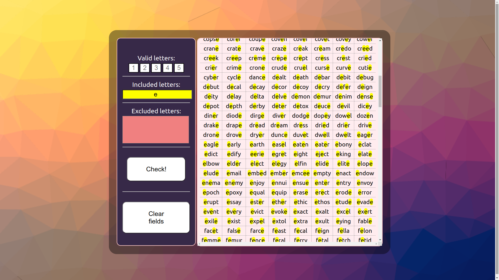

# WordleSolver

## What was the purpose of writing this program
Improving spring-boot and frontend skills and creating something a bit more complex than my recent projects. In this project mostly I focused on front side. I used Spring Boot, JavaScript, HTML and CSS.

## What it can do and what do you need
First, what is Wordle(https://www.nytimes.com/games/wordle/index.html & https://en.wikipedia.org/wiki/Wordle). In short. Wordle is a simple web-based game, where player have to guess five-letters word within six tries. After every guess, each letter is marked. If letter is green letter is correct and in correct position. If letter is yellow letter is correct, but on wrong position. If letter is gray this letter is not in this word. My app can take those hints, and return table with words which can be correct. Letters can't be included and excluded in one time and app not allowing this. To run, open the console in the directory with the pom.xml file and enter "mvn clean install" and then "mvn spring-boot:run". By default app is avaible on http://localhost:8080/.

_Screenshot 1_ \

_Screenshot 2_ \

_Screenshot 3_ \

